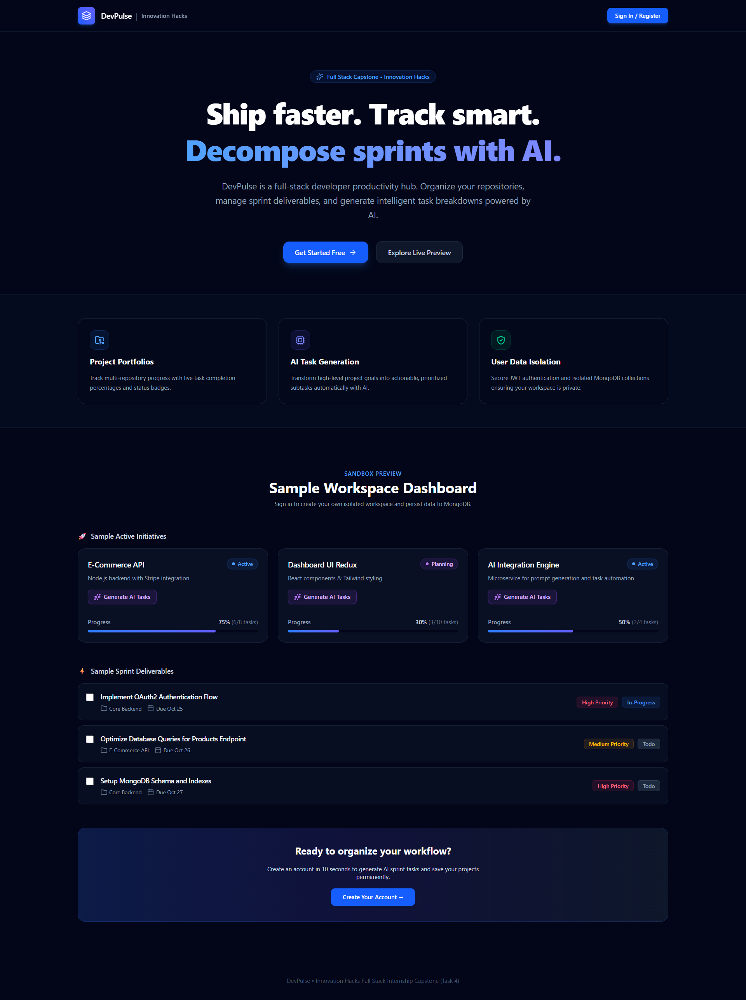

# ⚡ DevPulse — Full-Stack AI Developer Platform

**DevPulse** is an AI-powered developer productivity and project management platform built for the **Innovation Hacks Full Stack Internship**. It decomposes project scopes into prioritized sprints, manages tasks across full lifecycles, and pairs a ChatGPT/Gemini-style navigation interface with a resilient MERN and LLM backend.


---

## 🗺️ Milestone Checklist

- [x] **Task 1: Modern Frontend Development** (Completed)
- [x] **Task 2: Backend & REST API Development** (Completed)
- [x] **Task 3: Persistent Data Layer (Database Integration)** (Completed)
- [x] **Task 4: AI Integration & Full-Stack Deployment** (Completed)

---

## 🚀 Key Features

### 1. ChatGPT/Gemini-Style Dashboard Shell
- **Responsive Layout:** Sticky top navbar with global search, action controls, and an isolated desktop icon rail.
- **Mobile Slide-Over Drawer:** Accessible side drawer for smooth navigation across Overview, Projects, and Tasks without page overflow.
- **Dynamic Developer Profiles:** User registration supporting professional titles and Base64 avatar uploads rendered dynamically across headers and navigation.

### 2. AI-Powered Project Decomposition (Inception Labs)
- **One-Click Task Generation:** Integrated with **Inception Labs (`mercury-2`)** via OpenAI-compatible endpoints.
- **Structured Sprints:** Analyzes project scopes and auto-generates prioritized subtasks with calculated due dates.
- **Interactive AI Modal:** `AiGenerateModal` gives live decomposition feedback with loaders, error handling, and direct database synchronization.

### 3. Productivity Metrics & Activity Streaks
- **Dynamic Streak Calculation:** Tracks consecutive daily activity streaks calculated directly from task creation and update timestamps in MongoDB.
- **SVG Productivity Ring:** Real-time completion ratio tracking with dynamic progress bars across individual projects and global sprints.

### 4. Full-Stack Data & Security Pipeline
- **JWT Authentication:** Secure signup, login, session persistence (`/api/auth/me`), and route guards with `bcryptjs` password hashing.
- **Mongoose Relational Schemas:** Strong `ObjectId` references connecting Users, Projects, and Tasks with automated `.populate()` queries.
- **Config Resilience:** Direct-read configuration helpers to eliminate environment variable caching issues across ES modules.

---

## 🛠️ Tech Stack

- **Frontend:** React 18, Vite, Tailwind CSS, Lucide React, React Router
- **Backend:** Node.js, Express.js (10MB body parser for image uploads), OpenAI SDK
- **Database:** MongoDB, Mongoose ODM
- **AI Microservice:** Inception Labs API (`mercury-2`)
- **Authentication:** JSON Web Tokens (JWT), Bcrypt.js

---

## 📡 API Reference

| Method | Endpoint | Description | Auth |
| :--- | :--- | :--- | :---: |
| `POST` | `/api/auth/register` | Register user with role & avatar | No |
| `POST` | `/api/auth/login` | Authenticate user & issue JWT | No |
| `GET` | `/api/auth/me` | Fetch active authenticated session | Yes |
| `GET` | `/api/projects` | Get user projects with task counters | Yes |
| `POST` | `/api/projects` | Create new persistent project | Yes |
| `PUT` | `/api/projects/:id` | Update project metadata | Yes |
| `DELETE` | `/api/projects/:id` | Delete project and associated tasks | Yes |
| `GET` | `/api/tasks` | Get tasks with status/priority filters | Yes |
| `POST` | `/api/tasks` | Create task with relational foreign keys | Yes |
| `PUT` | `/api/tasks/:id` | Update task details or toggle status | Yes |
| `DELETE` | `/api/tasks/:id` | Permanently remove task | Yes |
| `POST` | `/api/ai/generate-tasks` | Decompose project into subtasks via `mercury-2` | Yes |

---

## ⚙️ Quickstart

### 1. Clone & Setup
```bash
git clone [https://github.com/CrshIVam16/DevPulse.git](https://github.com/CrshIVam16/DevPulse.git)
cd DevPulse
```

### 2. Backend Setup

```bash
cd backend
npm install
```

Create `backend/.env`:

```env
PORT=5000
NODE_ENV=development
MONGODB_URI=mongodb://127.0.0.1:27017/devpulse
JWT_SECRET=your_jwt_secret_key
INCEPTION_API_KEY=your_inception_labs_api_key
```

```bash
npm run dev
```

### 3. Frontend Setup

```bash
cd ../frontend
npm install
npm run dev
```

Open `http://localhost:5173` in your browser.

---

## 🔗 Submission Links

* **Task 1 Video:** [Watch Demo](https://drive.google.com/file/d/1MbvTNF2w0EB_2hszRwhUZnFN04ufCouV/view?utm_source=gemini)
* **Task 2 Video:** [Watch Demo](https://drive.google.com/file/d/1VFpWbKJPlWHtbqnS1cWkO_DCG-acvsDs/view?usp=sharing&utm_source=gemini)
* **Task 3 Video:** [Watch Demo](https://drive.google.com/file/d/1ph9oJakKwXxmIIaArei35DSGsWyXX3h-/view?usp=sharing&utm_source=gemini)
* **Task 4 Capstone Video:** [Watch Full Walkthrough](https://drive.google.com/?utm_source=gemini) *(Add your link)*
* **Live Deployment:** [DevPulse Production App](https://dev-pulse-seven-blue.vercel.app/?utm_source=gemini)